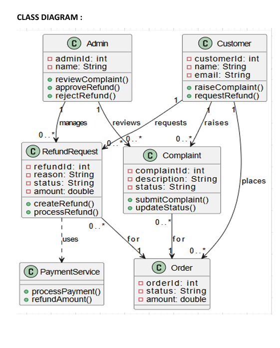
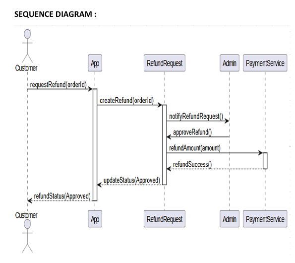

# Support and Refund Module

## Synopsis
The Support and Refund module allows customers to raise complaints and request refunds for their orders. 
If issues occur, the admin reviews and processes the request. Approved refunds are handled through the payment service.

## Features
- Raise complaints
- Request refunds
- Admin approval/rejection
- Refund processing

## Actors
- Customer
- Admin
- Payment Service

## UML Diagrams

### Class Diagram

### Sequence Diagram
